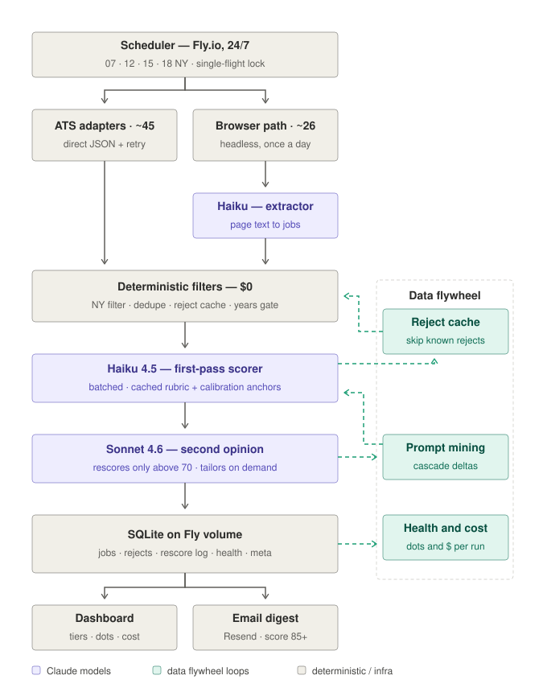

# Job Agent — an autonomous job-search concierge

*Kaggle × Google "AI Agents: Intensive Vibe Coding" capstone — **Concierge Agents** track.*

Job hunting is a grind of refreshing 70 career pages, skimming hundreds of
irrelevant postings, and occasionally missing the one that mattered. Job Agent
is a self-hosted, always-on agent system that does that grind for one person:
it scrapes ~70 company career sources on a schedule, AI-scores every posting
against the owner's résumé with a calibrated two-model cascade, presents the
survivors on a three-tier board, and emails a digest when something genuinely
strong appears. It runs 24/7 on a $5 VM and costs well under $1/day in
LLM tokens — because most of the engineering in this repo is about *not*
calling the model.

The entire system was **vibe-coded**: designed, built, debugged, and
cost-optimized conversationally with an AI coding agent, over roughly two
weeks of sessions.



## Course-concept mapping

| Course concept | Where it lives here |
|---|---|
| **Multi-agent system** | Four specialized model roles in a cost cascade: Haiku *extractor* (unstructured page text → jobs), Haiku *first-pass scorer* (batched, cached rubric), Sonnet *judge* (second opinion on scores > 70), Sonnet *tailor* (résumé/cover-letter rewrite on demand). |
| **MCP server** | [`mcp-server/`](mcp-server/) exposes the live agent as Model Context Protocol tools (board, scoring, source health, cost telemetry) usable from Claude Desktop, Gemini CLI, or Antigravity. |
| **Agent tools & interoperability** | 9 ATS JSON adapters (Greenhouse, Lever, Ashby, Workday, Oracle, Amazon, Eightfold, SmartRecruiters, Uber) + a Playwright browser path with XHR network capture for JS-gated career sites; REST API; Resend email. |
| **Memory & state** | SQLite on a persistent volume: the job board, a 30-day negative-dedup reject cache, a model-disagreement log, per-source health, cost telemetry. The agent's judgment *and* its economics improve as state accumulates. |
| **Evaluation & guardrails (Day 4)** | Structured outputs (JSON-schema-constrained responses), a golden-probe score tester, Sonnet-arbitrated false-negative audits, and disagreement mining that turns the judge's corrections into first-pass calibration anchors. |
| **Deployability (Day 5)** | Fly.io deployment with persistent volume, self-healing scheduler, scrape watchdog, per-source health dots in the UI, and per-scrape cost accounting in logs and UI. |

## The data flywheel

Three feedback loops make the system cheaper and smarter the longer it runs:

1. **Reject cache** — every posting that scores below threshold is remembered
   by key; boards repost the same jobs every day, so each bad job is scored
   exactly once, ever. Cost per scrape *declines* as the agent sees more of
   the market.
2. **Prompt mining** — every time the Sonnet judge overrides the Haiku scorer,
   both scores and both reasonings are logged. Mining ~300 of those
   disagreements revealed one dominant bias (functional mismatches parked at
   ~72) and produced calibration anchors now baked into the scorer's cached
   rubric. Validated result: the exact historical failure cases moved from
   ~72 to 15–18 on the first pass — which also eliminated ~70% of judge
   calls, since correctly-low scores never trigger the cascade.
3. **Health & cost telemetry** — every run updates per-source status dots and
   an estimated-cost line, which is what justified policies like
   "browser-path sources run once daily" and tells the owner which dormant
   sources deserve adapter work next.

## Cost engineering

Real numbers from the Anthropic console export: naive operation peaked at
**$7.4/day**; the optimized steady state targets **under $1/day** — a 10×
reduction with no scoring-quality loss:

- Deterministic pre-filters (location, dedup, reject cache, a years-of-experience
  hard-cap gate) discard ~90% of candidates before any token is spent
- Prompt caching of the résumé + scoring rubric (6k tokens, ~0.1× price on
  read), with warm-then-fan-out batch ordering so parallel batches read the
  cache instead of stampeding it
- Structured outputs eliminate parse-failure retries
- Conditional reasoning: discarded jobs get an 8-word verdict, not a paragraph
- Status-aware retries (never retry a 400 twice)
- Per-scrape cost lines make any regression visible the same day

## Security & privacy (Concierge-track requirement)

- Single-user by design; the résumé and all scored data live in SQLite on a
  private volume, never in the repo
- HTTP Basic Auth (`APP_PASSWORD`) in front of the entire app
- All secrets via environment (`.env` local, `fly secrets` in prod) — the
  repo contains none
- LLM responses are JSON-schema-constrained; scraped web content is sliced
  and filtered before it reaches a prompt

## Repo layout

```
src/            Node/Express app: scheduler, scraper, ATS adapters,
                browser path, AI layer, SQLite
public/         Dashboard UI (vanilla JS + Tailwind)
mcp-server/     MCP stdio server exposing the agent as tools
docs/           Architecture diagram, capstone writeup, video script
```

## Quickstart

```bash
npm install
npm run setup            # installs the Playwright Chromium used by the browser path
cp .env.example .env     # add your AI_API_KEY (Anthropic; or set AI_PROVIDER=openai
                         # with any OpenAI-compatible endpoint, incl. Gemini's)
node src/server.js       # http://localhost:5179
```

Add sources and paste a résumé in Settings, hit "Scrape now". To run it
always-on: `fly launch` (a `fly.toml` and `Dockerfile` are included), set
secrets with `fly secrets set AI_API_KEY=... APP_PASSWORD=...`, and enable
the schedule in Settings.

## Provider notes

The AI layer is provider-agnostic (`src/ai.js`): `AI_PROVIDER=anthropic` uses
the Messages API with prompt caching and structured outputs;
`AI_PROVIDER=openai` speaks the Chat Completions shape and works with any
OpenAI-compatible endpoint — including Gemini's
(`AI_BASE_URL=https://generativelanguage.googleapis.com/v1beta/openai`,
`AI_MODEL=gemini-2.5-flash`). The production deployment runs the
Haiku/Sonnet cascade — right model per task, swap freely.
